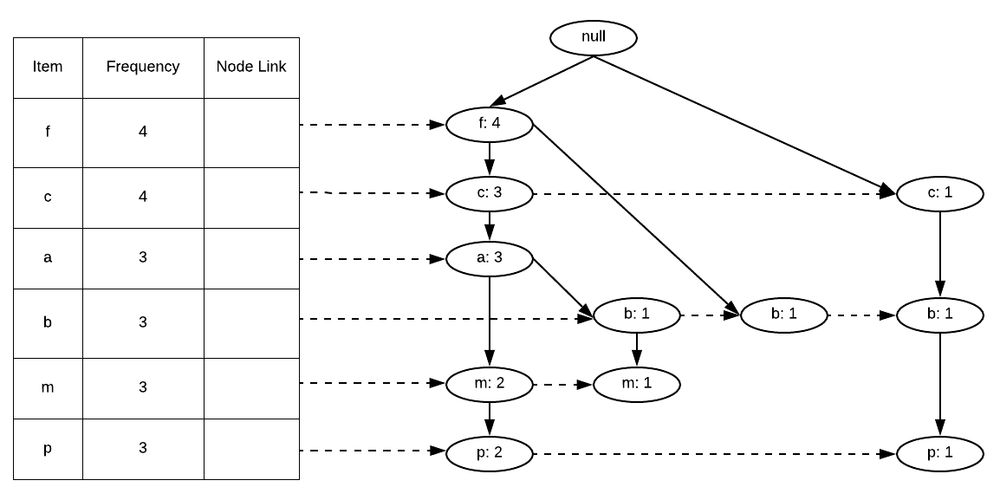

# Project report - Frequent Pattern Mining

Università Ca' Foscari Venezia - Computer Science MSc

Matteo De Giorgi (872029)

## Problem description
The problem that has been addressed is mining of frequent itemsets, where an itemset is the collection of one or more
items (e.g. {1, 2, 4, 10}), which is considered frequent when it appears in more than a given percentage of the input itemsets.

The input is composed by:

- The path to a file containing new-line separated lists items like the following:
```
1 2 3 4 5 6 7 8  
8 7 6  
6  
2 6 7 1  
1 6 7 8 10 11  
5 6 7 8  
1 2 3 4 6 7 8  
6 7 8
```
- A number representing the percentage of transactions that need to contain an itemset in order to be considered frequent.

For example, using a fraction percentage of 50% the result over the previously reported example is composed by 11 itemsets
as follows:
```
7 
7 6 
8 
8 6 
8 7 
8 7 6 
1 
1 6 
1 7 
1 7 6 
6 
```

## Sequential solution
In order to provide the first sequential solution it has been decided to use an approach based on Frequent Pattern Trees (FP-Trees),
which have been proven to be very effective for representing a compressed version of the transaction database (the input file).
In an FP-Tree each transaction is represented by a path from the root to a leaf, moreover a header table is used in order to keep
track of the first node for a certain item, which is then linked to all the subsequent ones in a list fashion.

[//]: #

In order to build the tree, it is first necessary to determine the frequency of each item and then sort them in each input itemset
by decreasing frequency. This is fundamental to ensure that the generated FP-Tree is as compact (and hence efficient) as possible.
Moreover, it has been enforced the uniqueness of each item in input, if an itemset with repeated items would be received then
the frequency of the repeated item would contribute only by 1, and the repetition would be deleted during the input parsing phase. 

Once the FP-tree is constructed the recursive, divide-and-conquer `FP-growth` algorithm is used to enumerate all frequent itemsets.
This algorithm can be summarized as follows:

```c++
list<list<Item>> FP-growth(FP-Tree tree, int minsup) {
  list<list<Item>> frequentItemsets
  for (item : tree.headerTable) {
    frequentItemsets.append(item)
    newTree = computePrefixTree(tree, item)
    recomputeSupport(newTree)
    removeItem(newTree, item)
    pruneInfrequent(newTree, minsup)
    partialFrequentItemsets = FP-growth(newTree, minsup)
    for (itemset : partialFrequentItemsets) {
      itemset.insertFront(item)
    }
    frequentItemsets.append(partialFrequentItemsets)
  }
  return frequentItemsets;
}
```

This recursive algorithm iterates over all the items in the header table associated to the FP-Tree received and for each of them:

- Creates a copy of the header table and FP-Tree with all the items' frequencies set to 0, but the ones relative to the chosen prefix
- Recomputes the support of all the tree iterating over the prefix item list (thanks to the header table, and their organization
as list), and for each of them follows the path to the root node and increase each node on the way by the frequency of the item.
- Remove the item chosen as prefix, since we are now taking it into consideration, and we assume the uniqueness of each item.
- Prune the items considered infrequent (since nodes' frequencies has been recomputed) in order to reduce the memory usage
  during the further recursions.
- Perform a recursive call to `FP-growth` using the prefix tree generated for the chosen item.
- For each frequent itemset returned by the recursive call, append the chosen prefix.

### First sequential implementation
The first approach to the sequential algorithm has been tried simplifying the canonical algorithm described above avoiding pruning
the FP-Tree between recursive calls, and hence without calling the functions `removeItem` and `pruneInfrequent`, but instead,
removing only the reference to the infrequent items by the header table.

This approach reduces the algorithmic complexity since removing the prefix item, and the infrequent items only from the
headerTable have constant time complexity per removal operation (given its implementation as associative map).
Instead, effectively removing them from the tree has a bigger computational cost since it implies starting from the first
node pointed by the header table and iterating over every item in the list. Moreover, it is possible that the removal of a node
triggers a cascade of join operations between nodes, since the children of a removed item can have the same value as one of its
uncles.

The downside of this approach is the huge memory usage, since the size of the FP-Tree stays the same from the beginning until
the end. This implies that in the worst case, when all the possible combinations of the items are frequent, we will need to store
2^_n_^ copies of the initial FP-Tree, where _n_ is the number of unique items.

Despite the more the list of prefixes is expanded, and hence the deeper the recursion into `FP-growth`, the lesser is likely that
the sequence can be considered frequent, hence it is not likely to approach the maximum theoretical upper limit of
2^_n_^ copies. It is still an extremely high upper bound and after experimental tests it has proven to make this approach
not feasible nor efficient.

### Second sequential implementation
The second approach includes the previously missing functions `removeItem` and `pruneInfrequent`. This immediately denoted a
heavy reduction of memory usage, which can be explained by the fact that for every chosen prefix item the prefix FP-Tree associated
to it now does not contain any infrequent item nor the chosen prefix item.

Since the previous implementation highlighted how important it is to make an efficient use of memory, this implementation
required a particular attention to the FP-Tree nodes pointers' ownership. Since it is easy to create reference cycles, which
would imply that nodes would not be actually deallocated causing memory leaks.

In order to solve this problem it has been decided that every FP-Tree node would contain strong references (`shared_ptr`) only to
his children and keep all the other references (to the parent or the next and previous node with the same value) as weak references
(`weak_ptr`).

Moreover, in order to implement the list of nodes with the same value it has been decided to use a doubly linked list. This has
the advantage to reduce the complexity of the removal operation of a specific node, since in order to find the previous one in
the list it is not necessary to start from the first node in the header table. This may not sound necessary at first, since the
removal operations that we need iterate over the exact list of nodes beginning from the header table, instead it has proven to
be a very useful choice since removing a node may result in having to merge one of his children with one of its uncles.

## Parallel decomposition
In order to parallelize the program it has been used OpenMP which provides a portable directive-based API in order to offer to the
programmer with a higher level of abstraction than pthreads.

### First parallel implementation
The first approach to the code parallelization has been to use the OpenMP for-loop directive in the main loop of the `FP-growth`
algorithm implementation. This implies splitting the computation of the prefix trees over multiple threads which resulted in a good
initial performance improvement.
For this implementation it has been necessary to multi-thread only the main loop in `FP-growth` and not all the nested ones, which
otherwise, would generate an exponential amount of threads, hence resulting in a heavy degradation of performance because of
their overhead (including the risk of reaching the maximum amount of threads in the system aborting the program execution).

Moreover, thanks to the coverage analysis, it has been determined that a big part of the execution time it is spent in the
function that deletes infrequent items. This function first deletes the item from the header table, and then iterates over the
list of items with the same value and removes them from the tree. This last step has been proven quite time-consuming, especially
over big datasets with many infrequent items.

Unfortunately, it has not been possible to parallelize this cycle iterating over all the elements using the OpenMP for-loop
directive, which requires to have a for loop expressed in the "Canonical Loop Form" and hence using a random-access iterator.
This because the implementation uses a manually implemented list, in fact every FP-Tree node, besides references to his parent and
children, contains also references to his predecessor and successor in this list. Therefore, only a bidirectional iterator could be
created, hence the cycle has been parallelized using the OpenMP explicit tasks subdivision.

Handling OpenMP tasks manually is slower than using a for-loop, since the latest subdivides the load equally among the items
(assuming a similar workload for each item), and the second assigns each iteration to a task which then needs to be scheduled to a
thread, hence having a higher overhead.

This last change required to ensure that nodes' frequencies are not updated concurrently by multiple threads, hence it has been
added OpenMP atomic sections to the arithmetic operations on frequencies.
Moreover, since now multiple deletions can happen concurrently it is necessary to ensure that operations on the underlying STL map data
structure holding the header table are thread safe. In order to do that an OpenMP critical section has been added ensuring that only
a single thread at a time can update the header table.

### Second parallel implementation
The first implementation has soon begun to present his main issues during experimental testing. Despite it is effective in some
datasets, it can easily result in an uneven load distribution among the threads, for instance, where there is one element that
appears in every itemset and has multiple children. In this case only 1 thread would be generated, since the for-loop was prevented
to spawn nested threads, hence having the worst balancing possible.

In order to solve this issue, the way the for-loop in `FP-growth` was parallelized has been rethought in order to have a better
distribution of the load also in nested recursive calls. That has been achieved using the OpenMP directive `taskloop`, which is
able to split the for loop in chunks and create a task for each of them, which will be then assigned to the first available thread,
where the amount of maximum concurrent threads is limited via command line parameter. 

Thanks to this new approach there is a better load balancement since every recursive step will be able to leverage on
multi-threading, the trade-off to accept is the increased overhead due to tasks scheduling. Multiple tests have been performed in
order to have a comparison between the approach based on the OpenMP `for` and `taskloop` directives. Which show that they produce
comparable results in datasets that were not problematic for the first parallel implementation, and provide a very good improvement
in the others.

Another improvement made in this implementation is the parallelization of the function to recompute the support once a new FP-Tree
projection needs to be computed (hence everytime a new prefix is selected in `FP-growth`). In order to do that OpenMP manual tasks
have been used again, hence when iterating over the list of nodes where the new support is computed from, a new task is created for
each of them.

### Third parallel implementation
After many experimental testing, it has been realised that some introduced parallel implementations have actually decreased performances
on certain datasets. For example the manual tasks creation during the support recomputation has proven to have very little if not a negative
effect on performances and hence it has been removed.

Moreover, the parallel implementation of `deleteItem` has proved to be quite debatable, since it is very helpful
when a lot of deletions takes place, for instance using high supports or datasets with many infrequent items. At the same time it causes 
overhead generating more tasks when the main effort is not deleting items, but exploring all the possible prefixes and hence in the
`FP-growth` algorithm. Hence, it is useful only in case the load needs to be balanced and there is a lack of executable tasks.

The parallelization of the items deletion function has been object to multiple tests, which resulted in its conditional inclusion, hence
offloading the best decision to the user since it is not possible to know how the parallel implementation will behave beforehand.

Another important change was the parallelization of the initial computation of the FP-Tree, which has been done using manual `task`
generation. Previously this was the only phase of the program that was not taking advantage of multithreading.
Therefore, now every ordered sequence read from the input dataset is processed by a different task and hence potentially by different
threads.

Critical sections added as part of the first parallel implementation has been changed in order to general purpose locks.
This has had the effect of reducing useless waits since now the lock is specific to an object instance and not just related to the code
section like before, hence, allowing multiple threads to be in the same critical section if it is related to different objects.

This has proved particularly useful during the deletion of items, since operations on the header table can be performed concurrently if
relative to two different tables. Moreover, it affects also the computation of the initial FP-Tree, which allows the modification of multiple
nodes at the same time and restricts only concurrent modifications to the same node.

## Results
After the third parallel implementation, many tests have been performed in order to verify the assumptions that motivated the parallelization
choices. In particular, it has been tested what are the limits of the implemented multithreading approach checking execution time and how
the load is subdivided among the various threads using various datasets.

One of the main goal of the parallel implementation is to ensure that the load is as balanced as possible among the various threads. This
has been tested making sure that the tasks queue is always populated and hence that the CPU utilization stays high along the whole execution
of the program.

Experimental results has shown that there is a good subdivision of the load, and hence for most of the datasets the algorithm is able to keep
the maximum amount of threads busy. There are some exceptions for datasets that include a lot of infrequent elements, these cases can be
improved using the parallelized deletion (using the `-e` option). The support fraction chosen by the user has a heavy impact on this, in
fact it influences the amount of items that requires pruning, hence it is necessary to find a good balance through experiments.

Unfortunately, there are still cases where not enough tasks can be produced in order to keep all the threads busy, this is a consequence
of the fact that there are many different item lists that needs to be deleted but only one list can be deleted at a time. The reason behind
this is that concurent deletions of different lists could interfere in too many ways to actually provide a performance improvement.
Hence, in the case where many short item lists needs to be pruned from the tree it is going to be difficult to generate enough tasks.

It has been tested how performance increases varying the amount of threads, and, as expected, we can always see a performance improvement
increasing the amount of threads. Up to the point where the number of CPU cores is reached, from then on we can see a stabilization that
eventually leads to a performance decrease due to the context switch overhead.